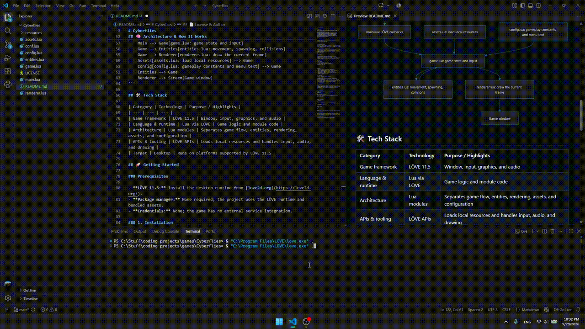
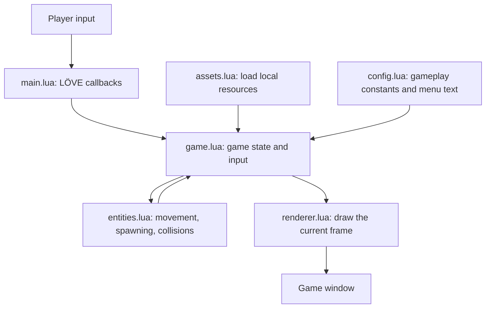

<div align="center">

# Cyberflies

**A self-contained arcade survival game that puts movement, aiming, and shooting on one mouse-driven screen**

[](https://love2d.org/)
[](https://love2d.org/)
[](https://www.lua.org/)
[](#-license--author)

</div>

---

<p align="center">
  
</p>

---

## 📌 Problem & Motivation

Cyberflies is a compact arcade game for players who want to get straight into an action loop without accounts, network access, or a lengthy setup. It keeps movement, aiming, and shooting together in a single-screen survival challenge.

**Cyberflies** keeps the experience focused:

- **Immediate play:** Start a run with a click; no configuration or account is required.
- **Local by design:** Gameplay and assets run on the player's computer without a remote service.
- **Readable controls:** Move toward the pointer, aim at it, and shoot with the same input device.

---

## ✨ Key Features

- **Moves** the player toward the mouse pointer while W is held.
- **Aims** toward the pointer and fires projectiles with a click.
- **Spawns** incoming enemies and tracks the player's score as enemies are defeated.
- **Plays** locally with bundled graphics, fonts, and sound; no network connection is needed.

### Controls

| Input | Action |
| --- | --- |
| Left click on the menu | Start a run |
| W + mouse movement | Move toward the pointer |
| Left click during a run | Shoot toward the pointer |
| Escape on the menu | Quit |

---

## 🧠 Architecture & How It Works



## 🛠️ Tech Stack

| Category | Technology | Purpose / Highlights |
| --- | --- | --- |
| Game framework | LÖVE 11.5 | Window, input, graphics, and audio |
| Language & runtime | Lua via LÖVE | Game logic and module code |
| Architecture | Lua modules | Separates game flow, entities, rendering, assets, and configuration |
| APIs & tooling | LÖVE APIs | Loads local resources and handles input, audio, and drawing |
| Target | Desktop | Runs on platforms supported by LÖVE 11.5 |

## 🚀 Getting Started

### Prerequisites

- **LÖVE 11.5:** Install the desktop runtime from [love2d.org](https://love2d.org/).
- **Package manager:** None required; the project uses the LÖVE runtime and bundled assets.
- **Credentials:** None; the game has no external service integration.

### 1. Installation

Clone the repository:

```bash
git clone https://github.com/coxteen/Cyberflies.git
cd Cyberflies
```

### 2. Environment Configuration

No `.env` file, credentials, or additional configuration is required.

### 3. Running Locally

From the project root, launch with LÖVE:

**Windows PowerShell**

```powershell
love .
```

If `love` is not on `PATH`, use the standard install location:

```powershell
& "C:\Program Files\LOVE\love.exe" .
```

**macOS / Linux**

```bash
love .
```

The game opens in a 1280 × 720 window. Click to start, then use the controls above.

## ⚙️ Configuration

Gameplay constants and menu text are defined in [`config.lua`](config.lua), including movement speed, acceleration, bullet speed, enemy speed, and the aiming angle adjustment. The window title, LÖVE version, and initial window size are set in [`conf.lua`](conf.lua).

## 📄 License & Author

- **Author:** [Costin Ghiujan](https://github.com/coxteen)
- **License:** Released under the [MIT License](LICENSE).   
